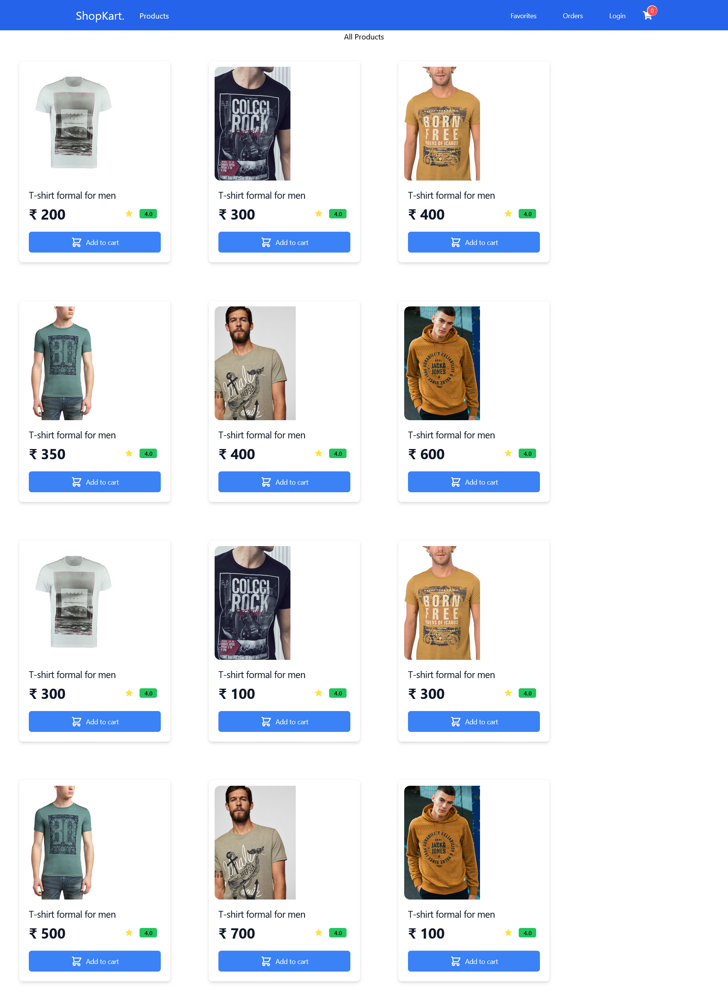
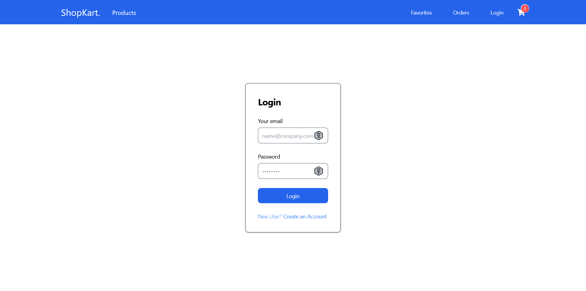
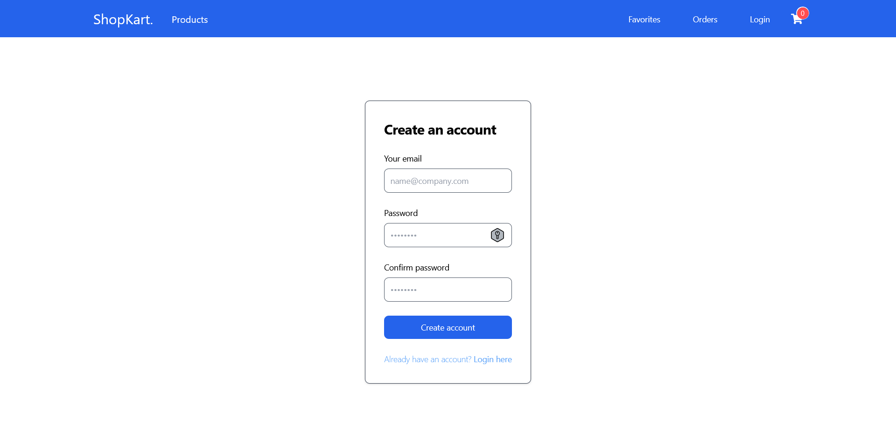
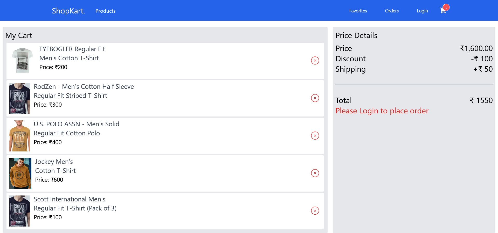
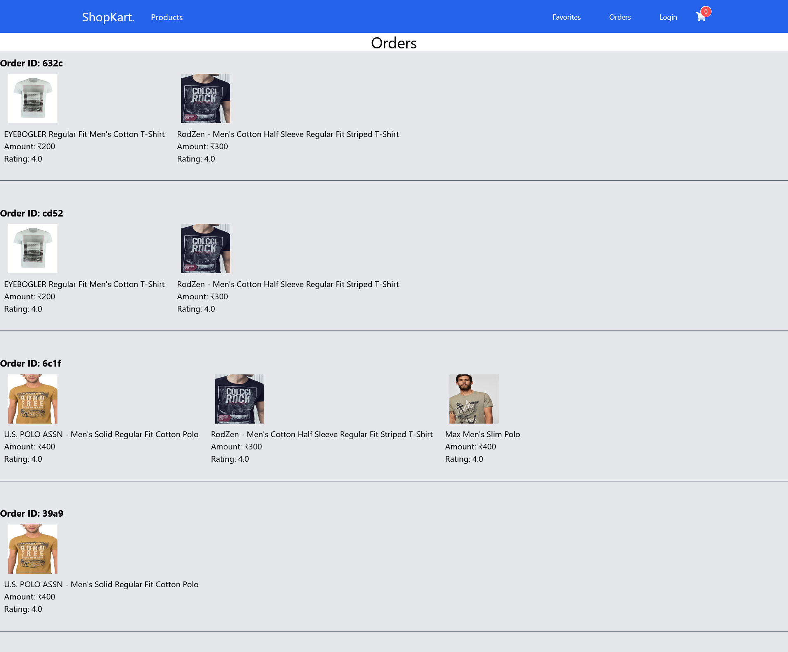

# ShopKart
A shopping website where the user can buy their favourites items.

# General Information
* Used HTML5, CSS3, Bootstrap and JavaScript to develop the front-end
* Node.js and Express.js to create server and develop back-end
* Key components like HomePage, Product, CartPage, Orders, and Favorite are mapped to specific routes, creating a cohesive and navigable user experience.

# Screenshots
* **Home**

* **Login Page**

* **Sign-Up Page**

* **Login Page**

* **Cart Page**

* **Order Page**

